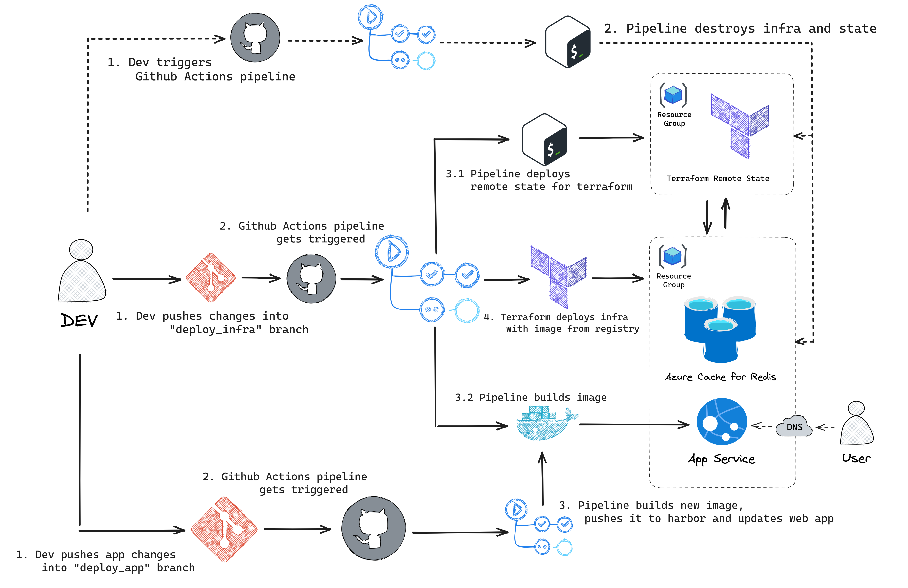
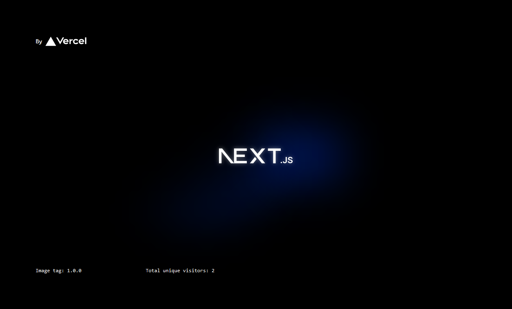
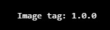
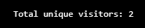
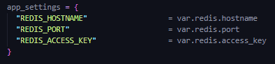
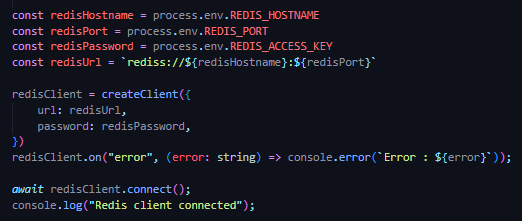
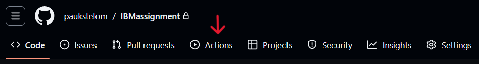
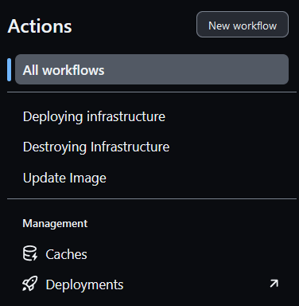
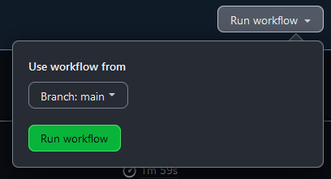
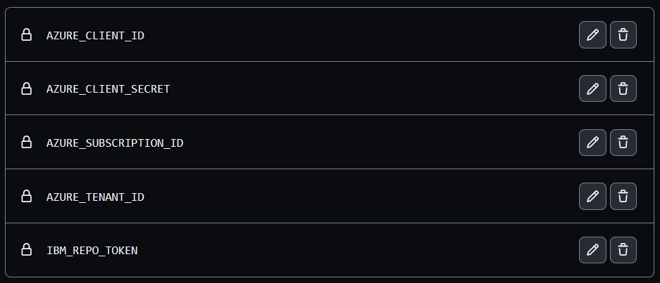

# IBM project

[](https://github.com/paukstelom/IBMassignment/actions/workflows/deploy_infra.yml) [](https://github.com/paukstelom/IBMassignment/actions/workflows/destroy_infra.yml) [](https://github.com/paukstelom/IBMassignment/actions/workflows/deploy_app.yml)

IBM project is my solution to a technical assignment provided to me in the second stage of the recruitment process to IBM. This assignment required me to deploy a web page which would show how many unique visitors have visited the page.

## Built with

![Azure] ![Terraform] ![Actions] ![Git] ![Docker] ![Bash] ![Redis] ![Next.js] ![Github]

# IMPORTANT

#### Azure Redis Cache resource can take 15-40 minutes to deploy, please give the pipeline up to 40 minutes to deploy. If terraform apply step is running, means its working. In addition to that, the image can take some time to be pulled into the Azure App Service. If website does not load, refresh couple of times to see the app

## Solution and architecture

My solution was to deploy the app to Azure Cloud using Github Actions

<center>

</center>

### The repo includes 3 different pipelines

* DEPLOY_INFRASTRUCTURE (.github/workflows/deploy_infra.yml) - This pipeline builds and pushes the image into image registry, deploys backend state for terraform if not found and deploys the infrastructure with the app.

* DEPLOY_APP (.github/workflows/deploy_app.yml) -This pipeline assumes that the infrastructure is already deployed. When app changes are pushed into the "deploy_app" branch, the pipeline builds the image, pushes it into the registry and deploys the app into the existing infrastructure.

* DESTROY_INFRASTRUCTURE (.github/workflows/destroy_infra.yml) - This pipeline destroys the infrastructure and backend state if specified in input.

## Web App

The web app is a simple Next.js app which stores the unique visitors value in Redis.



### Features

* Image tag - displays the current version/tag of the image. This tag injected during Dockerfile build and is taken from ./my-app/VERSION file. By incremeting this tag in VERSION file and pushing it to repo it is easy to test if the pipeline has sucessfully deployed the new version of the app.
  
  

* Unique visitors - displays the number of unique visitors. This value is stored in Redis and is incremented every time a new user visits the page.

  

## Redis

Redis is used to store the unique visitors value. The Redis is deployed as a Azure Cache for Redis service in a seperate resource.

### The connection is configured through terraform

* Terraform passess variables to the Azure App Service instace which injects them to the environment.

  

* Server-side code pulls these variables from the environment and connects to the Redis.

  

## Terraform

Terraform code is split into 2 modules: redis_cache and web_app

```bash
├── main.tf
├── modules
│   ├── redis_cache
│   │   ├── main.tf
│   │   ├── outputs.tf
│   │   └── variables.tf
│   └── web_app
│       ├── main.tf
│       ├── outputs.tf
│       └── variables.tf
├── outputs.tf
├── providers.tf
├── terraform.tfvars
└── variables.tf
```

# Getting started

There are 2 ways to use this repo: you can test the deployment here using manual workflow dispatch or you can fork the repo and use the pipelines yourself with your own secrets.

## Using this repo

This repo was made in a way that you can deploy the app without any additional modifications. \
The infrastructure is deployed on my personal Azure account. To do so:

* Go to Actions

<br>

* Select the workflow you want to run. (Use "Deploy infrastructure" first to deploy infra)
  
<br>

* Click "Run workflow" and fill in the variables if needed.



The app will deploy and you will be able to access it through the link provided in the terraform output.
Or you can go straight to <https://ibm-project-webapp.azurewebsites.net>

## Forking repo

This repo is configured to deploy the app to my Azure account. If you want to test it yourself, you can fork the repo and add the needed secrets (see below). Other that that, there are no additional changes needed.

## Secrets

If you want to fork the repo and use the pipelines yourself, you will have to add these secrets:

<br>

* AZURE_CLIENT_ID - for Azure access

* AZURE_CLIENT_SECRET - for Azure access

* AZURE_SUBSCRIPTION_ID - for Azure access

* AZURE_TENANT_ID - for Azure access

* IBM_REPO_TOKEN - token for your ghcr.io image repository with read and write permissions

<!-- MARKDOWN LINKS & IMAGES -->
<!-- https://www.markdownguide.org/basic-syntax/#reference-style-links -->

[Next.js]: https://img.shields.io/badge/next.js-000000?style=for-the-badge&logo=nextdotjs&logoColor=white
[Azure]: https://img.shields.io/badge/microsoft%20azure-0089D6?style=for-the-badge&logo=microsoft-azure&logoColor=white
[Terraform]: https://img.shields.io/badge/Terraform-7B42BC?style=for-the-badge&logo=terraform&logoColor=white
[Actions]: https://img.shields.io/badge/GitHub_Actions-2088FF?style=for-the-badge&logo=github-actions&logoColor=white
[Github]: https://img.shields.io/badge/GitHub-100000?style=for-the-badge&logo=github&logoColor=white
[Git]: https://img.shields.io/badge/GIT-E44C30?style=for-the-badge&logo=git&logoColor=white
[Bash]: https://img.shields.io/badge/GNU%20Bash-4EAA25?style=for-the-badge&logo=GNU%20Bash&logoColor=white
[Docker]: https://img.shields.io/badge/Docker-2CA5E0?style=for-the-badge&logo=docker&logoColor=white
[Redis]: https://img.shields.io/badge/redis-CC0000.svg?&style=for-the-badge&logo=redis&logoColor=white
